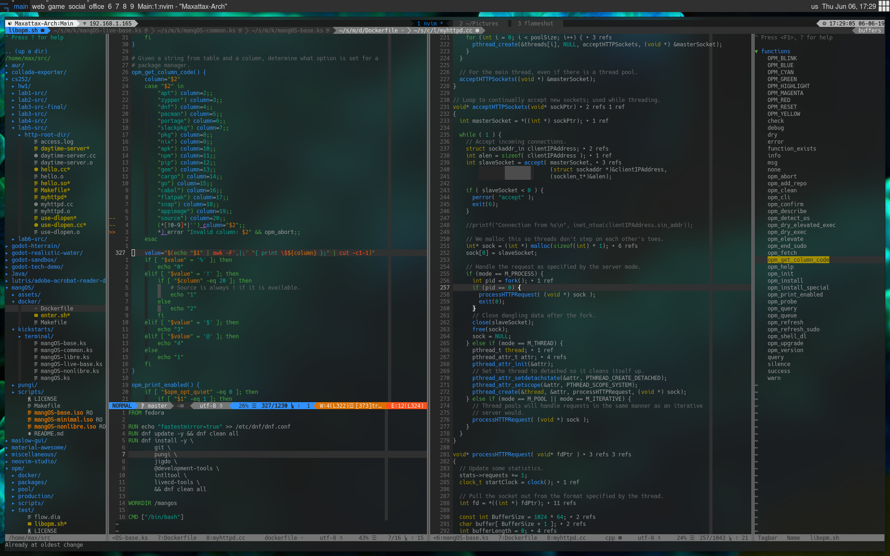

# Galactic
_A standard colorscheme to rule the entirety of the Galactic Empire!_



This is a theme for (Neo)Vim. It is inspired by Solarized, Gruvbox, and Tomorrow
Night. Its color pallete is designed with careful consideration to human
perception using CIELab/LCh color spaces. It is easy on the eyes for lengthy
coding sessions, takes advantage of transparency, and maintains neutral tones
such that it does not clash with other colorschemes.

This colorscheme utilizes true (24-bit) color, and as such requires a terminal
which provides true-colors, though it will attempt to find close colors for
non-24-bit terminals. I recommend checking out [Suckless's st](https://st.suckless.org/).
So you'll need:

- Vim ≥7.4.1799, or NeoVim, with `termguicolors` set, **and**
- [a true-color enabled terminal](https://gist.github.com/XVilka/8346728).

Galactic also works in MacVim, gVim, etc…: no configuration is needed.

## Options

The following options are inherited from Solarized:

- `g:galactic_visibility`: one of `"normal"` (default), `"low"`, `"high"`;
- `g:galactic_diffmode`: one of `"normal"` (default), `"low"`, `"high"`;
- `g:galactic_termtrans`: make terminal background transparent if set to `1`
  (default: `0`).

The following options were not available in the original Solarized:

- `g:galactic_statusline`: one of `"normal"` (default), `"low"` or `"flat"`;
- `g:galactic_term_italics`: set to `1` to enable italics in the terminal
  (default is `0`).
- `g:galactic_old_cursor_style`: set to `1` if you want to use the original
  Galactic's cursor style (default: `0`). By default, the cursor is orange/red
  in light themes, and blue in dark themes (but please note that your terminal
  may override the cursor's color).
- `g:galactic_extra_hi_groups`: set to `1` to enable Galactic
  filetype-specific syntax highlighting groups (default is `0`). Please be aware
  that there is [a long standing
  issue](https://github.com/altercation/solarized/issues/102) with extra
  highlight groups.
- `g:galactic_use16`: see above.

All these options may be used with any Galactic variant.


## Troubleshooting

**Hey, I do not get the right colors when running Vim inside tmux or in my
favourite true-color enabled terminal!**

Try putting this in your `.vimrc`:

```viml
let &t_8f = "\<Esc>[38;2;%lu;%lu;%lum"
let &t_8b = "\<Esc>[48;2;%lu;%lu;%lum"
```

See `:h xterm-true-color` for the details.


## Hacking

Do you want to hack the theme? Install
[Colortemplate](https://github.com/lifepillar/vim-colortemplate), edit the
`*.colortemplate` files, then rebuild the colorschemes by sourcing
`scripts/make_colorschemes.vim`.

If you extend or improve Galactic, please consider submitting a pull request!
